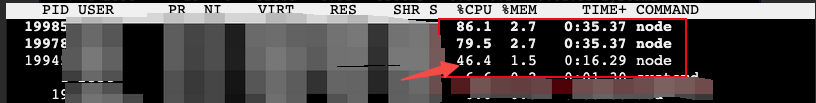

# node-unix-socket

`node-unix-socket` allows you to use some nonblocking sockets that are not supported by Node.js native modules, including:

- Using `SO_REUSEPORT` enabled TCP [net.Server](https://nodejs.org/dist/latest-v16.x/docs/api/net.html#class-netserver)
- unix seqpacket(`SOCK_SEQPACKET`) sockets
- unix datagram(`SOCK_DGRAM`) sockets

`node-unix-socket` is a [napi-rs](https://napi.rs/) based [Node.js addons](https://nodejs.org/docs/latest-v16.x/api/addons.html). This lib uses [libuv](https://libuv.org/) inside Node.js so that it won't introduce any other asynchronous runtimes.

## API Documents

[API Documents](./docs/modules.md)

## `SO_REUSEPORT` enabled TCP net.Server

The [cluster](https://nodejs.org/dist/latest-v18.x/docs/api/cluster.html) module share server ports by accepting new connections in the primary process and distributing them to worker processes.

With `SO_REUSEPORT`, sockets will be distributed by kernel instead, and which should be more performant especially for scenario of having a lot of short-lived connections.

For example, the arrow in the image below shows cpu usage of a PM2 primary process which we found in our environment.



Note that `SO_REUSEPORT` might behave much differently across operating systems. See this [post](https://stackoverflow.com/questions/14388706/how-do-so-reuseaddr-and-so-reuseport-differ) for more information.

### Example

```js
const { createReuseportFd } = require('node-unix-socket');
const { Server, Socket } = require('net');

const port = 8080;
const host = '0.0.0.0';

// create multple servers listening to a same host, port.
for (let i = 0; i < 2; i += 1) {
  const fd = createReuseportFd(port, host);
  const server = new Server((socket) => {
    socket.on('data', (buf) => {
      console.log(`server ${i} received:`, buf);
      // echo
      socket.write(buf);
    });
  });

  server.listen(
    {
      fd,
    },
    () => {
      console.log(`server ${i} is listening on ${port}`);
    }
  );
}

setInterval(() => {
  const client = new Socket();
  client.on('data', (buf) => {
    console.log('client received:', buf);
    client.destroy();
  });
  client.connect(port, host, () => {
    client.write(Buffer.from('hello'));
  });
}, 1000);
```

## Seqpacket Sockets

`SOCK_SEQPACKET` sockets are like `SOCK_DGRAM` sockets and they will keep message boundaries.

Note that `SOCK_SEQPACKET` sockets don't work on MacOS.

### Example

```js
const { SeqpacketServer, SeqpacketSocket } = require('node-unix-socket');
const os = require('os');
const path = require('path');
const fs = require('fs');

const bindPath = path.resolve(os.tmpdir(), './my_seqpacket.sock');

try {
  fs.unlinkSync(bindPath);
} catch (e) {}

const server = new SeqpacketServer();
server.listen(bindPath);
server.on('connection', (socket) => {
  socket.on('data', (buf) => {
    console.log('received', buf.toString());
  });
});

const client = new SeqpacketSocket();
client.connect(bindPath, () => {
  const data = ['hello, ', 'w', 'o', 'r', 'l', 'd'];

  for (const str of data) {
    client.write(Buffer.from(str));
  }
  client.end();
});
```

## Dgram Sockets

### Example

```js
const { DgramSocket } = require('node-unix-socket');
const os = require('os');
const path = require('path');
const fs = require('fs');

const path1 = path.resolve(os.tmpdir(), './my_dgram_1.sock');
const path2 = path.resolve(os.tmpdir(), './my_dgram_2.sock');

try {
  fs.unlinkSync(path1);
  fs.unlinkSync(path2);
} catch (err) {}

const socket1 = new DgramSocket();
const socket2 = new DgramSocket();

socket1.bind(path1);
socket2.bind(path2);

socket2.on('data', (data, remoteAddr) => {
  console.log(`socket2 received: ${data.toString()}`);
  // echo
  socket2.sendTo(data, 0, data.length, remoteAddr);
});

socket1.on('data', (data) => {
  console.log(`socket1 received: ${data.toString()}`);
});

setInterval(() => {
  const buf = Buffer.from('hello');
  socket1.sendTo(buf, 0, buf.length, path2);
}, 1000);
```

## CONTRIBUTING

[CONTRIBUTING.md](./CONTRIBUTING.md)

## LICENSE

MIT
